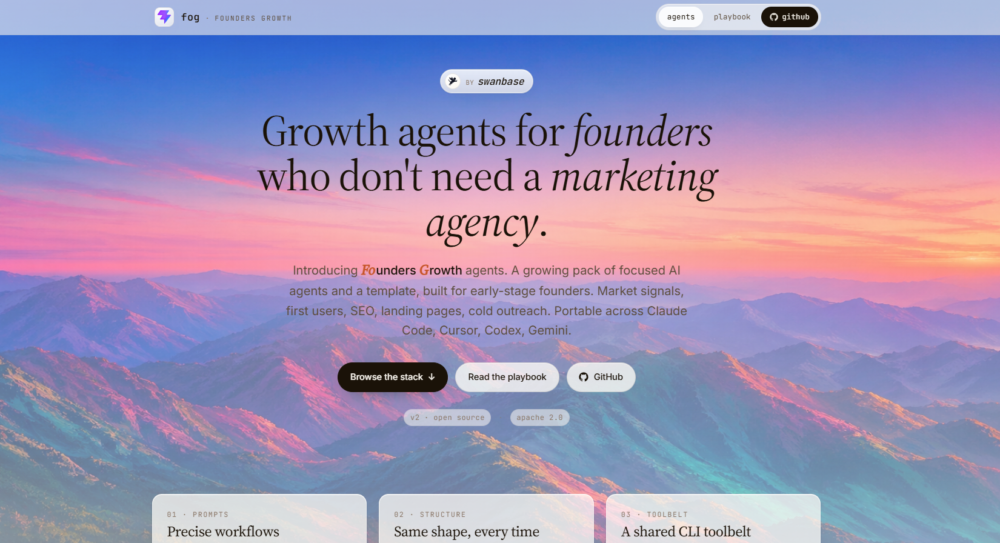

# Founders Growth Agent Stack

[](./LICENSE)
[](#)
[](https://www.anthropic.com/news/agent-skills)
[](https://github.com/the20100/cli-skills)
[](#build-your-own)

A growing pack of focused AI agents for early-stage founders who want to grow without hiring a marketing agency. Market signals, first users, SEO, landing pages, cold outreach.

Portable across **Claude Code, Cursor, Codex CLI, Gemini CLI**. No vendor lock-in. Each agent is a folder of markdown that any harness reads as context.

Companion site: [fog-agents.com](https://fog-agents.com).



---

## The 6 agents

| Agent | When to use |
|-------|-------------|
| [`market-signal`](./agents/market-signal/) | Before writing copy or code. Read what real users say in Reddit, X, forums, HN. |
| [`first-users-hunter`](./agents/first-users-hunter/) | After validation. Map where your first 10 to 50 users hang out + outreach templates. |
| [`seo-audit`](./agents/seo-audit/) | One-shot SEO snapshot when traffic dips. GSC + live SERP + prioritized fix list. |
| [`landing-page-analyzer`](./agents/landing-page-analyzer/) | Before paying for traffic or after a launch. CRO heuristic audit on a single page. |
| [`cold-outreach-builder`](./agents/cold-outreach-builder/) | When you need 50 to 200 first conversations. Sequence + per-prospect personalization. |
| [`carousel-builder`](./agents/carousel-builder/) | When you need a brand-consistent LinkedIn / Instagram carousel from a chat prompt. HTML/CSS + Playwright, no Canva Pro. |

Plus [`_template-agent`](./agents/_template-agent/), the canonical scaffold every agent in the stack follows. Fork it to build your own.

---

## How it works

The stack is **prompts + structure + a CLI toolbelt**.

- **Prompts**: each agent ships an `AGENT_<NAME>.md` with a precise workflow (inputs, steps, output skeleton, failure modes).
- **Structure**: every agent has the same folder layout, so your harness sees the same shape regardless of which one you run.
- **Toolbelt**: most agents use CLIs from [`the20100/cli-skills`](https://github.com/the20100/cli-skills) (exa, firecrawl, gsc, perplexity, instantly). Install once, every agent benefits.

---

## Install

### 1. Clone the stack

```bash
git clone https://github.com/tns-research/fog-agents.git
```

### 2. Install the CLI toolbelt (one-time, shared across all agents)

```bash
git clone https://github.com/the20100/cli-skills.git ~/cli-skills

# Add to PATH (~/.bashrc, ~/.zshrc, or per-session)
export PATH="$HOME/cli-skills/exa-cli/bin:$HOME/cli-skills/firecrawl-cli/bin:$HOME/cli-skills/perplexity-cli/bin:$HOME/cli-skills/instantly-cli/bin:$PATH"
```

### 3. Set the API keys you need

Each agent's README lists which keys it requires. The most common:

```bash
export EXA_API_KEY="..."          # https://dashboard.exa.ai/api-keys
export FIRECRAWL_API_KEY="..."    # https://www.firecrawl.dev/app/api-keys
export PERPLEXITY_API_KEY="..."   # https://www.perplexity.ai/settings/api
export INSTANTLY_API_KEY="..."    # only for cold-outreach-builder if pushing to Instantly
```

For `seo-audit`, also install the `gsc` binary (one-time Go build, see [`agents/seo-audit/README.md`](./agents/seo-audit/README.md)).

---

## Run an agent

Each agent is a self-contained workflow in `agents/<agent-name>/AGENT_<NAME>.md`. Point your harness at it and ask in plain language. The exact phrasing varies slightly per harness.

### Claude Code

```
Run the market-signal agent at agents/market-signal/AGENT_MARKET_SIGNAL.md.
Market: freelance invoicing tools for designers. Language: en.
```

Claude Code reads the workflow file, auto-discovers the `SKILL.md` files under `agents/market-signal/skills/` as it loads each step, and writes the report to your project folder.

### Cursor, Codex CLI, Gemini CLI

Open the agent file (`agents/market-signal/AGENT_MARKET_SIGNAL.md`) in your IDE chat or paste it as the system prompt for a fresh session. Then prompt:

```
Follow this workflow. Market: freelance invoicing tools for designers. Language: en.
```

The harness loads inner skills as the workflow references them.

### Any harness, manual

If your harness does not auto-load context, copy the contents of `AGENT_<NAME>.md` into the chat as your first message, then provide the inputs the workflow asks for. The agent file is self-describing and lists every input, output location, and failure mode.

> The root `AGENTS.md` briefs any AI-aware harness on the repo conventions on first read. Most modern coding agents pick it up automatically.

---

## Project conventions

### Output location

Every agent writes its deliverable outside its own folder, in your project structure:

```
<your-projects-root>/<project-slug>/<agent-name>/<label>-<YYYYMMDD>.md
```

Example:
```
~/work/acme/market-signal/market-signal-20260427.md
```

### Per-project config

Persistent parameters (brand, market, ICP, target queries) live in:

```
<your-projects-root>/<project-slug>/<agent-name>/config.json
```

The agent creates this file on first run from its `config.example.json`.

---

## Repo layout

```
fog-agents/
├── README.md                       (this file)
├── AGENTS.md                       (briefing for any AI-aware harness)
├── LICENSE
├── NOTICE
└── agents/
    ├── _template-agent/            (canonical scaffold)
    ├── market-signal/
    ├── first-users-hunter/
    ├── seo-audit/
    ├── landing-page-analyzer/
    ├── cold-outreach-builder/
    └── carousel-builder/
```

The companion **site** for this stack ships at [fog-agents.com](https://fog-agents.com).

---

## Build your own

Fork [`agents/_template-agent/`](./agents/_template-agent/). Read its `AGENT_TEMPLATE.md`. Fill in the workflow, the inputs, the output template. The structure is the contract. Stick to it.

Hard rules:
- ❌ No vendor-specific tool calls (no `mcp__*`, no `claude-*`, no harness-coupled APIs).
- ❌ No absolute paths to a single user's machine.
- ✅ Use POSIX paths from the user's chosen project root.
- ✅ Use shell + `cli-skills` CLIs.
- ✅ Work the same in Claude Code, Cursor, Codex CLI, Gemini CLI.

---

## About swanbase

[swanbase](https://swanbase.co) is an early-stage accelerator. We help first-time founders go-to-market and grow from 10 to 1,000 customers. Year-round, 2% equity.

[Apply →](https://swanbase.co)

## License

Apache 2.0.
