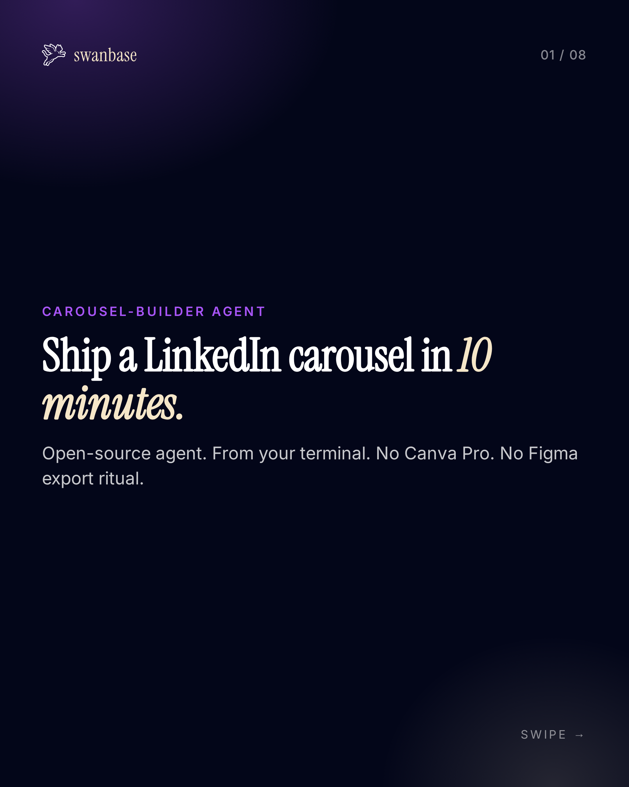
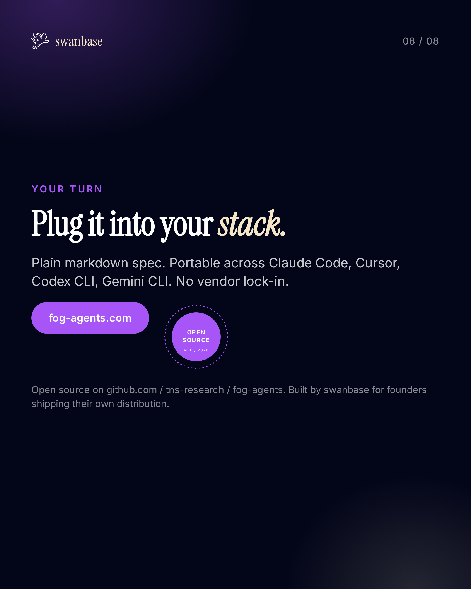

# Example, swanbase explainer carousel (2026-05-09)

A real run of `carousel-builder`, the explainer deck for the agent itself, rendered with [swanbase.co](https://swanbase.co) brand tokens. 8 slides, 4:5 ratio, EN, founder tone.

This example shows how the 4-step pipeline (angles, plan, brand, render) produces a posting-ready deck from a single chat prompt + a brand URL.

## Cover and CTA

| Slide 1 (cover) | Slide 8 (CTA) |
|---|---|
|  |  |

The 6 inner slides walk through the pipeline (Why, Steps, Angles, Plan, Brand, Render). Full PDF + PNG sequence are produced by the agent in the user project folder, not committed here for size reasons.

## Inputs the user gave

- **Topic**: "how the carousel-builder agent works, founder explainer"
- **Brand URL**: `https://swanbase.co`
- **Platforms**: `linkedin`, `instagram`
- **Ratio**: `4:5` (1080x1350)
- **Slide count**: 8
- **Language**: EN
- **Tone**: founder
- **Outputs**: `pdf` + `png`
- **Images**: none (text-only deck, no fal AI calls)

`config.json` used for this run is reproduced under [Config snapshot](#config-snapshot) below.

## Slide manifest

| # | Type | Title | Notes |
|---|---|---|---|
| 1 | cover | Ship a LinkedIn carousel in 10 minutes. | Brand wordmark, kicker "carousel-builder agent" |
| 2 | content-text | Carousels eat hours we don't have. | Why we built it, takeaway in highlight |
| 3 | content-list | Four steps. No clicks. | Numbered pipeline: Angles, Plan, Brand, Render |
| 4 | content-text | Topic in. Angles out. | Step 1, with mono code block sample |
| 5 | content-text | Slide-by-slide plan, in markdown. | Step 2, layered-cards SVG accent |
| 6 | content-text | Drop your URL. Get your brand. | Step 3, hexagonal honeycomb of brand axes |
| 7 | content-text | Render. Export. Post. | Step 4, phone-frame mockup, PDF / PNG split |
| 8 | cta | Plug it into your stack. | fog-agents.com, open-source stamp badge |

## Brand snapshot, extracted from `swanbase.co`

| Token | Value | Source | Confidence |
|---|---|---|---|
| `bg` | `#030619` | screenshot:dominant | 0.90 |
| `bg_alt` | `#0a0e2a` | manual:card-tone | 0.70 |
| `text_primary` | `#ffffff` | css:body.color | 0.95 |
| `text_muted` | `#aab0c4` | manual:muted | 0.75 |
| `accent` | `#a855f7` | screenshot:CTA-button | 0.85 |
| `accent_secondary` | `#f5e6c8` | screenshot:wordmark-cream | 0.65 |
| `border` | `rgba(255,255,255,0.10)` | css:inline-rgba | 0.80 |
| `font_heading` | `Instrument Serif, serif` | css:h1.font-family | 0.85 |
| `font_body` | `Inter, sans-serif` | css:body.font-family | 0.90 |
| `logo_url` | `swanbase_logo_icn.svg` | dom:img-or-svg-near-top | 0.75 |

Brand validated against a test slide before rendering the full deck. See `references/brand-extraction.md` for the heuristic playbook.

## Engine path

Rendered via the **Playwright fallback**, not `slides2pdf`. On this layout, `slides2pdf` injects CSS that overrides flex `min-width: 0` and breaks the cover headline overflow. The agent detects rendering issues during the per-slide PNG check and switches engines automatically. See `references/engine-fallback.md`.

Final outputs:
- `carousel.pdf`, 4.3 MB, 8 pages, native PDF for LinkedIn document upload
- `slide-01.png` to `slide-08.png`, 2160x2700 @ 2x device scale, for Instagram carousel
- `index.html`, self-contained source deck for inspection or manual tweaks

## Creative SVG patterns used

This deck uses 4 patterns from `examples/svg-creative-gallery.md`:

- **Slide 5**, layered-cards depth stack (slide-plan visual metaphor)
- **Slide 6**, hexagonal honeycomb (4 brand axes: color, type, logo, voice)
- **Slide 7**, phone frame mockup (mobile preview right-rail)
- **Slide 8**, open-source stamp badge (next to CTA)

All patterns inherit brand tokens automatically, no per-deck restyling needed.

## Config snapshot

```json
{
  "project": "swanbase",
  "platforms": ["linkedin", "instagram"],
  "ratio": "4:5",
  "slide_count": 8,
  "outputs": ["pdf", "png"],
  "brand_url": "https://swanbase.co",
  "language": "en",
  "tone": "founder",
  "fal_model": "fal-ai/nano-banana-pro",
  "fal_max_images": 0,
  "images": []
}
```

## Posting guidance the agent returned

- **LinkedIn**: upload `carousel.pdf` as a document post. Native swipe UX. Caption hook = slide 1 line.
- **Instagram**: upload `slide-01.png` to `slide-08.png` as a carousel. 4:5 fits mobile feed.
- **Hashtags**: 3 to 5, topic-relevant only.

## Reproducing this run

```
Run the carousel-builder agent at agents/carousel-builder/AGENT_CAROUSEL_BUILDER.md.
Topic: how the carousel-builder agent works, founder explainer.
Brand URL: https://swanbase.co. Platforms: linkedin, instagram. 8 slides, 4:5, EN.
```

The agent walks through the 4 steps interactively, asking for confirmation at each gate (angle pick, slide plan edit, brand validation) before committing to render.
